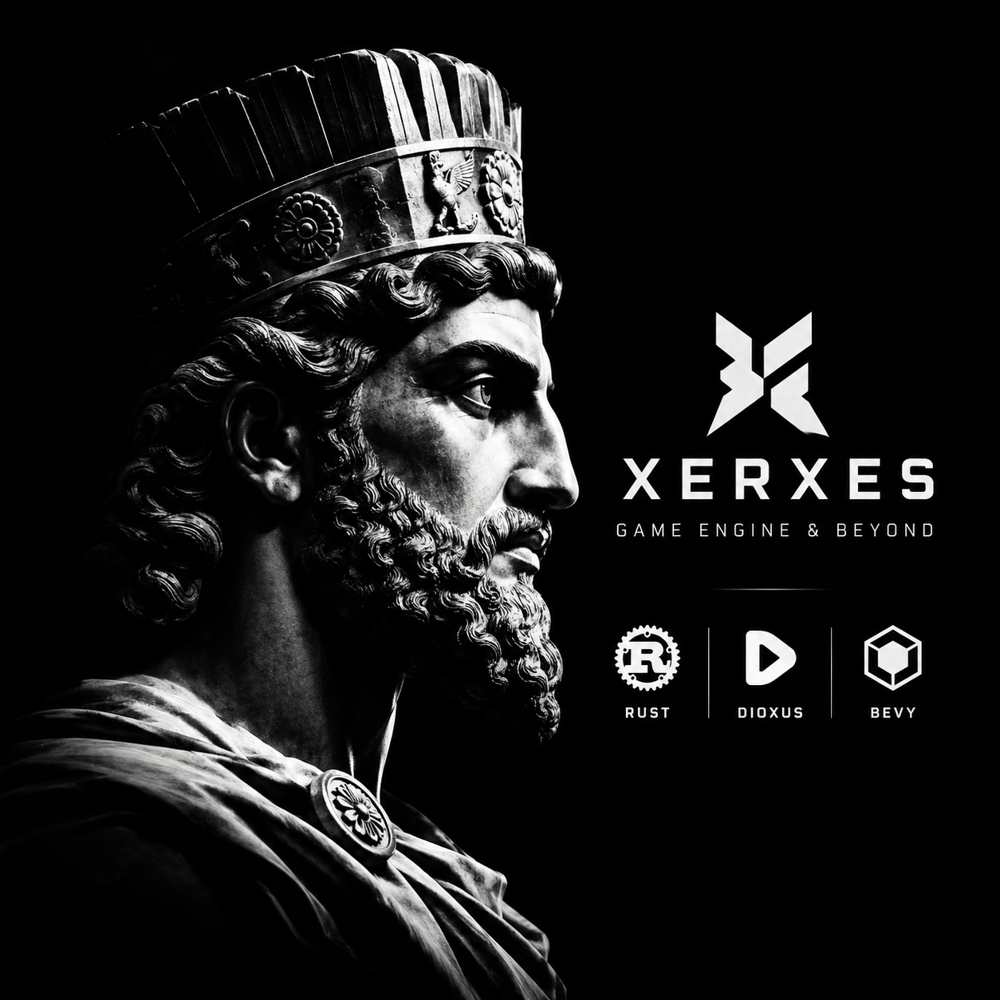

[](./Xerxes-Engine.png)

# Xerxes

**Xerxes is a fullstack game engine.** Bevy has no editor; Xerxes is one: a Dioxus editor, a few engine concepts (project settings, scenes, prefabs, bundles) and ready-to-use `.rs` templates for making Bevy games on web, windows and android. And unlike most engines, which stop at the client and leave you to build the server, Xerxes also covers the backend: an API (auth, users, game services) and a multiplayer server, grown alongside the engine. Rust end to end.

- **Engine and editor** (`engine/`): Bevy games, authored as typed `.rs` assets.
- **API** (`backend/src/modules/api/`): accounts, sessions, game data. Axum, SQLx, PostgreSQL, Redis.
- **Multiplayer** (`backend/src/modules/multiplayer/`): a Rust port of [Colyseus](https://github.com/colyseus/colyseus), the Node.js multiplayer server (the main reference; [Golyseus](https://github.com/soshyant-joshaghani/Golyseus), a Go conversion of it, shows such a port is practical): rooms, clients, matchmaking, server-authoritative state sync, reconnect. See [multiplayer.md](__docs__/multiplayer.md). It starts in the same process as the API and is built to split into its own container when WebSocket load calls for it ([backend.md](__docs__/backend.md)).

Xerxes is grown bottom-up from small real games. A game is built first, and only the pieces proven reusable move into the engine. The server grows the same way: each multiplayer feature is driven by a game that needs it. It started from the Rust-Dioxus kit and keeps that kit's Axum backend.

## What makes Xerxes different

- **A Project Manager, like a real editor.** The editor starts at the Project Manager: your games and the template games in one searchable list, **New Project** with the name checked as you type (a ready unique name is already filled in), **Open**, and **Use as template**. It works standalone: the exe and the APK need neither the repo nor the backend (they use the device's disk), and the web editor reaches the same projects through the local backend.
- **A starter, not a pile of templates.** Every new project begins from the engine's own empty `starter` (project settings and one scene). One scaffold creates projects for the editor, the backend and `game new`, so they are always identical.
- **Add-ons: copy it, own it.** Optional gameplay (camera and character controllers, HUD, pause) lives in `engine/addons`. Adding one copies its source into your game together with the add-ons it needs, never overwriting a file you changed. After that it is just your code. They are compiled into the build crate, so the editor, the backend and the CLI all offer exactly the same set.
- **Template games are read-only.** Finished games ship as references you can run and study, and "Use as template" clones one into your own project; the editor and backend refuse to change the original.
- **Everything you author is Rust data.** Scenes, prefabs and project settings are typed `.rs` files that the game compiles as normal Rust and the editor parses and writes back, with no script layer or custom format in between.
- **Typed names ([`Name.Type.rs`](#nametypers-the-type-is-in-the-name)).** Assets are named `Name.Type.rs` (`main.scene.rs`, `coin.prefab.rs`, `my-game.project.rs`, and `crate.image.rs`, `hero.mesh.rs`, `theme.audio.rs`, `intro.video.rs` beside their files). The Project browser shows each asset once, with its type and a small preview, and moving or deleting a file takes its meta along.
- **Scenes are 2D or 3D, games are not.** A game can mix a 2D menu and a 3D world; the editor shows 2D scenes flat and 3D scenes in perspective.
- **Game modes are part of the engine.** Every level declares a mode on a taxonomy of Sides x Win Condition (Solo, Coop, Duel, N-gon against Score, Objective, Role, Survival) plus modifiers and the outside-the-grid kinds ([game-modes.md](__docs__/game-modes.md)).
- **One source for every platform.** The editor UI is the same Dioxus code on web, windows and android (the DOM on the web, Blitz painted over the Bevy window natively). Games are Bevy only, with bevy_ui, so no game or export ever carries Dioxus.
- **Art ships as bundles.** Files are zipped by bundle id at build time, downloaded and extracted before use on every platform, with named input actions so gameplay never reads raw keys.
- **The backend is part of the engine.** An API with documentation generated from its own handlers (Swagger and Scalar), and a multiplayer server, as two series of modules that can move into separate containers. Every web build, engine or game, comes with a Dockerfile so it runs on another server.
- **Android is first-class.** NativeActivity builds with cargo-apk (no Gradle), and a patched winit gives Android a real mouse in the editor.

## Name.Type.rs: the type is in the name

Every asset Xerxes knows is named `Name.Type.rs`. The name says what the thing is; the `.rs` says that it is plain Rust data, which the game compiles as normal Rust and the editor parses and writes back. No manifest, no hidden metadata files, no custom format.

```text
assets/
  my-game.project.rs          project settings (exactly one)
  scenes/
    main.scene.rs             a scene
    arena.scene.rs
  prefabs/
    coin.prefab.rs            a prefab
  art/
    crate.png                 an external file ...
    crate.image.rs            ... and its config, right beside it (import settings, bundle)
    hero.glb
    hero.mesh.rs
  audio/
    theme.ogg
    theme.audio.rs
  logic/
    mover.rs                  your own logic modules stay plain
```

| Name | Type | What it holds |
|------|------|---------------|
| `*.project.rs` | project settings | Title, flow, input actions, window, backend, icon. One per project |
| `*.scene.rs` | scene | The objects of a 2D or 3D scene |
| `*.prefab.rs` | prefab | A reusable tree of objects, with nested prefabs |
| `*.image.rs` | image config | Import settings and bundle of `x.png`, `.jpg`, `.webp`, ... |
| `*.mesh.rs` | mesh config | The same for `x.glb`, `.gltf` |
| `*.audio.rs` | audio config | The same for `x.ogg`, `.wav`, `.mp3`, `.flac` |
| `*.video.rs` | video config | The same for `x.mp4`, `.webm` |

What it buys:

- **The type is readable everywhere**: in the file tree, in a diff, in `grep`, in the Project browser. Nothing has to be opened to know what a file is.
- **A meta, like Unity's, without the hidden clutter.** An external file's config sits beside it as ordinary typed Rust. The browser shows the pair once (the meta is hidden, with the file's type and a small preview), and moving, renaming or deleting the file takes its meta with it, in the editor and in the backend.
- **One rule, in one place.** The naming lives in `xerxes_build::types` and is used by the build step, the backend and the editor, so they can never disagree. The build refuses what would be ambiguous (two files that would share one meta, two project files) and warns about a meta with no file.
- **Compiled, not interpreted.** `build.rs` turns the typed files into Rust modules (`main.scene.rs` becomes `assets::scenes::main_scene`), so scenes, prefabs and settings are checked by the compiler.
- **Extensible by adding a type.** A new kind of asset is a new `Type` and a `Name.Type.rs` in the same family, and it gets the browser, the build and the backend rules for free.

**Status:** Phase 1 (foundation). Games run on Bevy alone, with a bevy_ui HUD, on web, windows and android. The engine app draws its Dioxus editor UI over a Bevy stage on every platform (the DOM on the web, Blitz natively), joined to the stage by a typed bridge. The dev and publish pipeline works from day one. See [__docs__/engine.md](__docs__/engine.md) and [`__plans__/PROGRESS.md`](__plans__/PROGRESS.md).

```bat
__ctrl__\xerxes-ctrl.bat setup-local
__ctrl__\xerxes-ctrl.bat backend run dev      REM infra + backend (API, multiplayer, worker); --slim: no Redis/worker
__ctrl__\xerxes-ctrl.bat engine run web       REM engine app, hot reload: http://engine.localhost (direct :5100); Play games from there
__ctrl__\xerxes-ctrl.bat game list            REM games/ A-Z from 1 (the engine has its own `engine` commands)
__ctrl__\xerxes-ctrl.bat template list        REM games/__templates__/ A-Z from 1 (Darius lives there)
__ctrl__\xerxes-ctrl.bat template dev darius      REM a game: web (default), windows or android
__ctrl__\xerxes-ctrl.bat template publish darius  REM release build into dist/darius/
__ctrl__\xerxes-ctrl.bat game dev my-game     REM the same for a game of yours in games/
__ctrl__\xerxes-ctrl.bat engine publish all   REM release builds of the engine app into dist/engine/
__ctrl__\xerxes-ctrl.bat test all
__ctrl__\xerxes-ctrl.bat cleanup              REM delete every target/ and dist/ (--dry-run lists first; keeps .env, .venv, __temp__, your games)
```

Every target (engine app and games) runs on **web**, **windows** and **android**. See [__docs__/games.md](__docs__/games.md). All commands: [__docs__/cli.md](__docs__/cli.md).

Linux and macOS use `__ctrl__/xerxes-ctrl.sh`. Prerequisites: Python 3.10+ for `__ctrl__`, and Docker for the backend services. On Windows, Rust links with the MSVC Build Tools (C++ workload). The first Bevy build takes several minutes.

## Layout

```text
engine/                the engine: library xerxes_engine + the engine app (xerxes-engine)
  src/modules/         what games use, Bevy only: assets, bundles, flow, project, runtime, scene
  src/editor/          the engine app: Dioxus editor UI (host, panel, catalog, bridge) over a Bevy stage
  build/               xerxes_build: the games' build step, asset naming rules, project scaffold
  starter/             the empty project New Project starts from
  addons/              optional gameplay a game copies (camera and character controllers, HUD, pause)
  platform/            android/ (entry, icons), windows/ (exe icon)
  winit/               winit with the Android mouse patch
games/                 games made with the engine: each its own crate (and, for `game new` games, its own Git repo, gitignored here)
  __templates__/       games committed with the engine, read-only in the editor: the Darius games (`darius`, in progress; `cyrus` later) and finished games
dist/                  release builds from `engine publish` / `game publish` / `template publish` (gitignored)
backend/               Axum + SQLx + Tokio: the API series (auth, users, system, engine services) and the multiplayer series, one process today, split-ready
tests/                 engine/, backend/, contract/
__docs__/ __plans__/ traefik/ __ctrl__/
compose.yml compose.dev.yml
```

## Making a game

1. `__ctrl__\xerxes-ctrl.bat game new my-game`: creates `games/my-game` from the engine's own empty `starter` project (one scene), names it, and runs `git init`.
2. Edit its `.rs` assets (scenes, prefabs, project settings) in the editor or by hand, and add what you need from `engine/addons` (camera and character controllers, HUD, pause). A game owns its copies.
3. `game dev my-game` while working, and `game publish my-game` for a release build.
4. When the game is finished, it can move to `games/__templates__/`.

See [__docs__/games.md](__docs__/games.md).

## Backend (API and multiplayer)

The backend has two series of modules that share only `core` and never import each other: the **API** (Route → Service → Repository (SQLx) → PostgreSQL, Redis for cache and jobs, following the [FoxG wire contract](../../CONTRACT.md)) and **multiplayer** (rooms and realtime over WebSocket; only a health route exists today). `SERVICES=all|api|multiplayer` picks what a process serves. See [__docs__/backend.md](__docs__/backend.md).

```bat
__ctrl__\xerxes-ctrl.bat backend run dev
```

| Service | URL |
|---------|-----|
| API (Swagger) | http://api.localhost/docs |
| API (Scalar) | http://api.localhost/sdoc |
| Adminer | http://adminer.localhost |
| Traefik | http://localhost:8080 |
| Direct API | http://localhost:8000/docs |
| Superuser | `admin@example.com` / `Admin@1234` |

Copy `.env.example` to `.env`. Variable names match Fast (`SECRET_KEY`, `POSTGRES_*`, `REDIS_*`, `FIRST_SUPERUSER*`).

**Docs:** [AGENTS.md](AGENTS.md) · [ROADMAP.md](ROADMAP.md) · [__docs__/](__docs__/) · [plans](__plans__/PROGRESS.md) · [`__ctrl__`](__ctrl__/README.md). Index: [foxg-kit](../../README.md).
